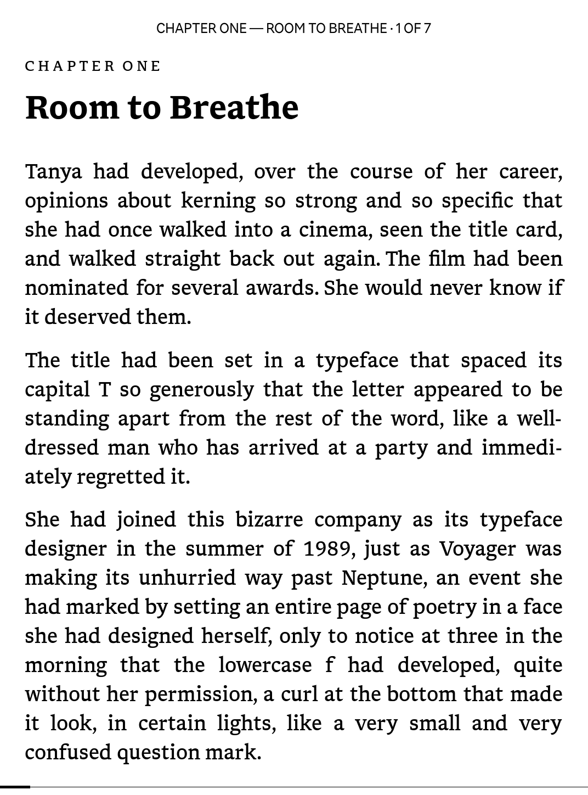
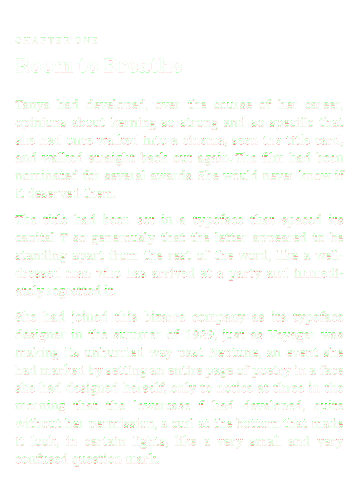
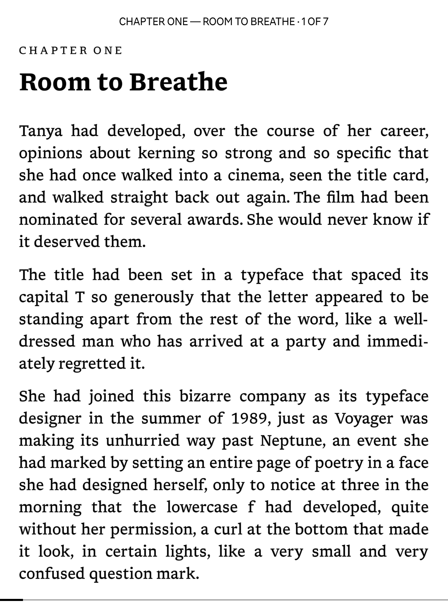
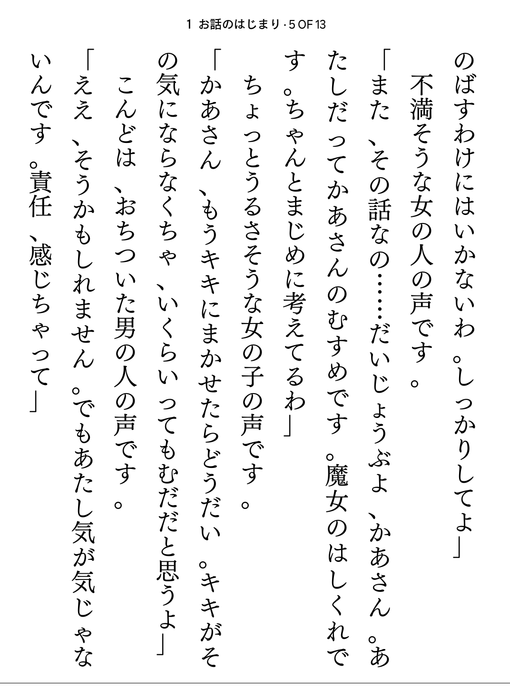
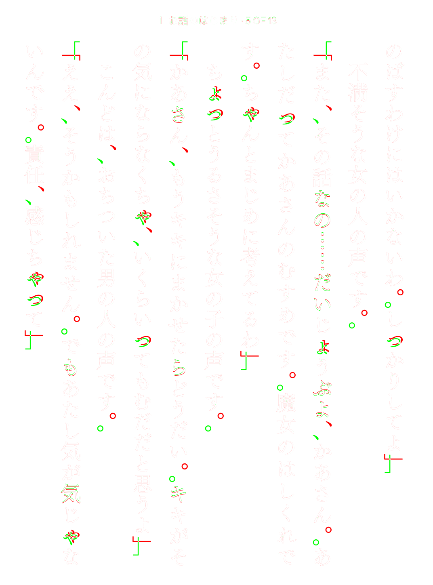
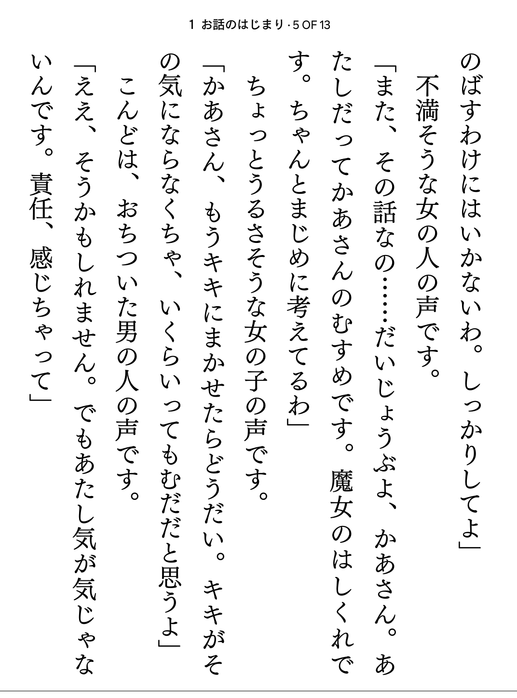
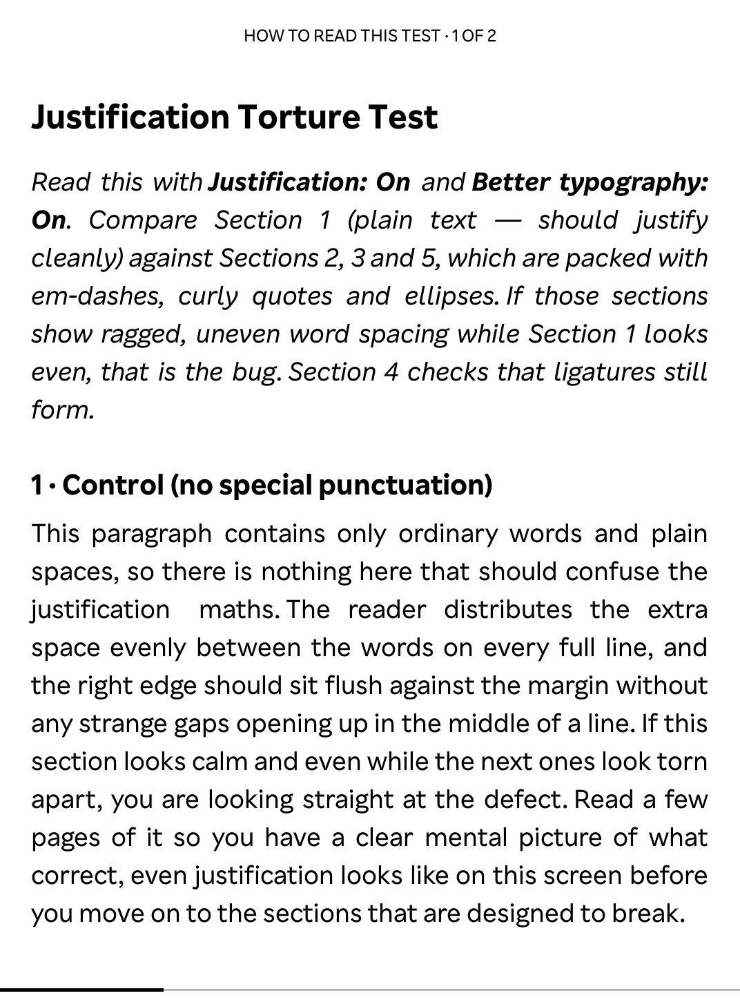
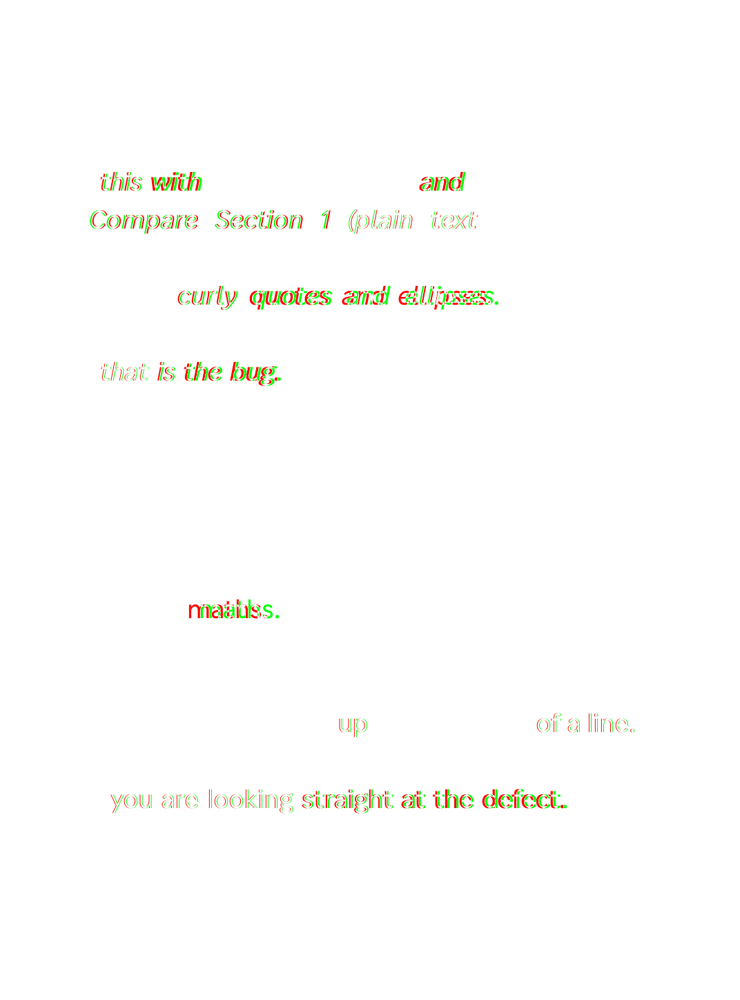
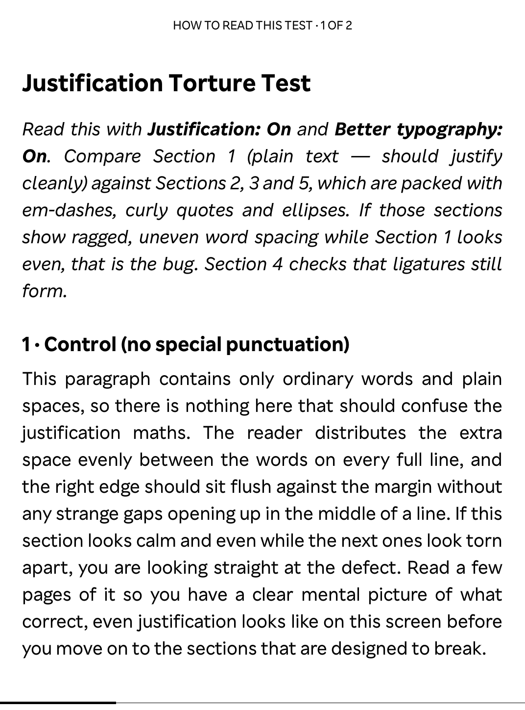

# NickelTypeFix

A [NickelHook](https://github.com/pgaskin/NickelHook) mod for Kobo eReaders that fixes several **text-rendering defects** in the reader's old Qt 5.2 / QtWebKit / Monotype iType stack. 

Each fix is independent and fail-safe. Individual fixes engage only if they can safely be applied, or otherwise don't apply. You can disable individual fixes via a configuration file in `.adds/nickel-type-fix`.

> [!IMPORTANT]
> This mod works on Kobo software version **4.x only** (inert on 5.x). See [Compatibility](#compatibility) for more information about compatibility.

## What it fixes

1. **Glyph "wobble"**: letters that drift a pixel up/down, giving an uneven line, on fonts with no hinting instructions. 
→ loads unhinted fonts, so iType stops grid-fitting inconsistently.
2. **Vertical (tategaki) CJK text** rendering sideways/misplaced under `optimizeLegibility`. 
→ keeps vertical books on WebKit's correct rendering path.
3. **Justified kepubs breaking at sentence boundaries** (uneven gaps) under `optimizeLegibility`. the main justification fix. 
→ corrects Qt's justifier so the boundary space gets its share.
4. **Justification skewing around punctuation** (em/en dashes, ellipses, curly quotes). 
→ secondary justification fix.
5. **Reader font falling back to the system font** in a kepub book: now and then a chapter's text renders in the default system font instead of the reading font you picked, and paging forward doesn't fix it (only changing the font, or reopening the book, does). 
→ re-applies your reading font on every chapter, so a chapter that happened to draw before the font was ready gets corrected in place.

## Why was this made?

**This fixes what is usually broken when you enable `optimizeLegibility`, which is justification and vertical CJK text.**

The point is to keep `optimizeLegibility` (which gets you ligatures, better text rendering, and optionally hyphenation) without any bugs. The cause of the bugs and the mechanism for each fix is [documented here](ABOUT.md).

## Prerequisite: enable `optimizeLegibility`

The first fix (glyph wobble) is the standout, and has been my personal pet peeve with Kobo's renderer. This fix is independent of everything below, needs no configuration, and is arguably the biggest single improvement the mod makes. It just works for every font. Yay!

Fix 5 (reader-font fallback) is also independent: it has nothing to do with `optimizeLegibility` and just runs on its own for kepub books.

The justification and vertical-text fixes (2 to 4), by contrast, only do anything when Kobo's WebKit **`optimizeLegibility`** text-rendering path is turned on. It's off by default and is a manual opt-in in the Kobo config file (**not** a UI setting). Edit `KOBOeReader/.kobo/Kobo/Kobo eReader.conf` and add:

    [Reading]
    webkitTextRendering=optimizeLegibility

Then reboot. With this off, the vertical and justification fixes will correctly log that they engaged, but you won't see a difference because the broken render path is never taken. You now get the following with `optimizeLegibility` set:

- Working GPOS functionality w/ fonts (improved tracking and kerning)
- Hyphenation and ligatures (advanced font features)
- Working justification (*fixed with this mod)
- Working vertical text rendering (*fixed with this mod)

## Screenshots

These are actual page captures from the author's own **Kobo Clara BW** before and after installing the mod.

The middle **diff** overlays the two: **red** is ink the fix removed (its old position), **green** is ink the fix added (its new position), white is unchanged. This way, the effect is obvious even where it's subtle on the page.

### 1. Glyph outline rendering fix ("wobble" fix)

Letters can drift exactly one pixel off the baseline; the diff lights up nearly every glyph the unhinting re-rasterizes:

| original | diff | fixed |
|---|---|---|
|  |  |  |

### 2. Vertical text orientation fix

CJK punctuation (`、` `。`) and small kana float centered in the
cell instead of tucking to the top-right where vertical Japanese needs them:

| original | diff | fixed |
|---|---|---|
|  |  |  |

### 3. Justification fix

Most noticeable: a starved gap at the sentence boundary (`justification   maths.`) with the rest of the line over-stretched, vs. even word spacing:

| original | diff | fixed |
|---|---|---|
|  |  |  |

## Configuration

Settings live in `KOBOeReader/.adds/nickel-type-fix/config` (auto-created with these defaults on
first boot; there's no shipped template file). Changes take effect on reboot.

| Key | Default | Meaning |
|-----|---------|---------|
| `ntf_enabled` | `1` | Master switch. `0` = behaves as if not installed. |
| `ntf_no_hinting` | `1` | Fix 1 (wobble): load glyphs unhinted. `0` = stock. |
| `ntf_hinting_allowlist` | *(empty)* | Comma-separated font families to keep natively hinted, e.g. `Georgia, Kobo Nickel`. |
| `ntf_vertfix` | `1` | Fix 2 (vertical text). |
| `ntf_justify_kospan` | `1` | Fix 3 (koboSpan-boundary justification, the main one). |
| `ntf_justify_punct` | `1` | Fix 4 (punctuation justification). |
| `ntf_kepub_fontfix` | `1` | Fix 5 (reader-font fallback): re-apply the reading font on each kepub chapter. `0` = stock. |
| `ntf_log` | `0` | Verbose logging to `nickel-type-fix.log`. Off by default (a healthy boot logs nothing); problems are always logged regardless. `1` = log everything. |

By default the log stays empty on a healthy boot; anything that goes wrong (a fix that can't apply on your firmware, a failed patch, a safety trip) is always logged. Set `ntf_log` to `1` to also log each fix engaging, so one boot tells the whole story. A problem in the config file itself (a misspelled setting, a malformed line, an invalid value) is warned about and switches on full verbose logging for that boot automatically, so a config mistake always diagnoses itself in the log.

## Compatibility

Requires Kobo firmware **4.21+ (the 4.x series, which uses Qt 5.2 / QtWebKit / iType)**. 

**It does not work on 5.x (Qt6 / Chromium: no iType, no QtWebKit, and NickelHook doesn't load there).**

The mod is not tied to any one model. The two in-memory patches related to justification anchor to position-independent instruction patterns, verified byte-identical across the 4.38 and 4.45 firmware branches (Sage, Elipsa, Libra 2, Clara 2E … and Clara BW/Colour, Libra Colour).

## Safety

There are two independent layers of protection, so a failure at worst sits a single fix out. The mod should also not be able to brick the device.

### Whole-mod boot failsafe

Before any hook or in-memory patch is applied, NickelHook renames the plugin to `libnickeltypefix.so.failsafe`. It starts the three-second rename-back timer only after NickelTypeFix has initialized successfully.

If applying the hooks or the justification patches ever crashes or hangs Nickel during boot, that rename-back never runs: on the next boot the plugin is no longer at its load path, the mod stays disengaged, and the boot loop is broken automatically. No user action is needed to recover.

### Per-fix graceful degradation

Each fix engages only if it can be applied safely, and a failure in one never affects the others.

1. Hooked and looked-up symbols are optional: if a symbol isn't present on a given firmware, that fix does not run (instead of aborting the mod).

2. If the justification fix can't locate its instruction pattern, or the bytes at a target site aren't what's expected, the fix logs and is skipped. When it does apply, all of its edits are located and verified up front and are written both-or-nothing (a mid-write failure rolls the already-patched sites back).

3. The hinting fix carries a persistent `disabled-by-safety` marker: if `FT_Load_Glyph` is ever unexpectedly unavailable at runtime, it records the marker and passes glyphs through untouched on this and every later boot, leaving the vertical and justification fixes running.

4. The hinting marker is written atomically and an unreadable marker is treated as unsafe, so a storage or permission error cannot silently re-enable a fix that previously tripped its safety shutdown.

5. The reader-font fix publishes a new `KepubBookReader` only after its real constructor completes, tracks it through its destructor, and only consumes a pending chapter repair on the same reader view. A missing lifetime hook disables that repair rather than calling an unverified object.

6. Justification patches validate the complete target range and instruction alignment before writing, keep the containing page executable so another Nickel thread cannot fault in unrelated code on that page, replace each instruction with one atomic store, verify the bytes, restore the original segment permissions, and roll back every site touched if a later step fails. If a rollback itself cannot be verified, NickelTypeFix logs the failure and invokes the firmware's normal reboot command before the failsafe can be disarmed (with the kernel reboot syscall as a fallback), so the next start is stock.

## Build

Install Podman/Docker and build with NickelTC:

```sh
git submodule update --init
./build.sh          # → KoboRoot.tgz + src/libnickeltypefix.so
```

## Install

Copy `KoboRoot.tgz` to the Kobo's `.kobo` folder, eject, and reboot. The mod should automatically install itself. After an automatic restart, when your home screen is visible again, the mod should have loaded!

## Uninstall

Delete `KOBOeReader/.adds/nickel-type-fix/uninstall` and reboot; NickelHook removes the mod on the next boot. The in-memory patches revert automatically (nothing was written to disk).

## Notes

On the first boot after installation, the mod also removes the older standalone mods it supersedes so they don't co-load. You probably won't be impacted, as these were mostly used by the author and distributed to only a handful of people before this mod was released.

Specifically, the following files are deleted (if present):

- `/usr/local/Kobo/imageformats/libnickelhintfix.so`
- `/usr/local/Kobo/imageformats/libnickeljustifyfix.so`
- `KOBOeReader/.adds/nickelhintfix/` (config directory)
- `KOBOeReader/.adds/nickeljustifyfix/` (config directory)

Nothing else is ever removed, and this cleanup does not run on later boots.

## Development

This repository was created with the assistance of large language models (specifically, Claude Opus 4.8, GPT 5.5, and Claude Fable 5). All of it was carefully reviewed by the author, and tested on the author's actual Kobo devices before release.

## License

MIT.
